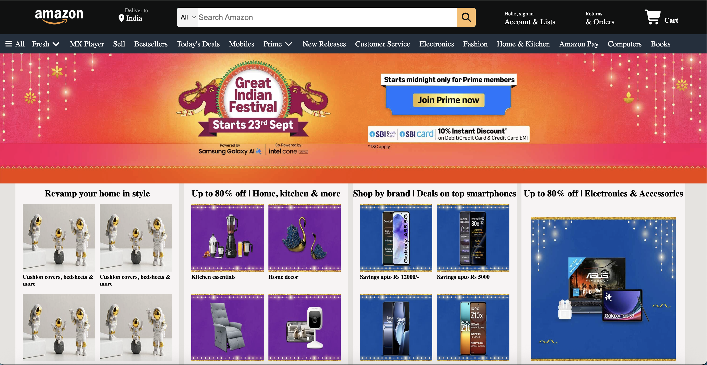
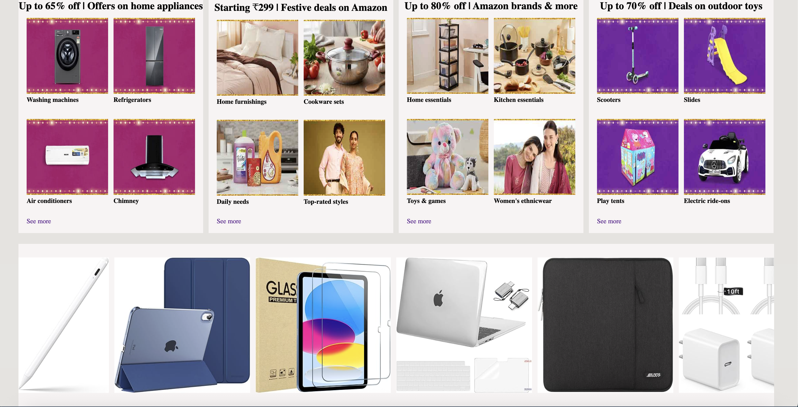
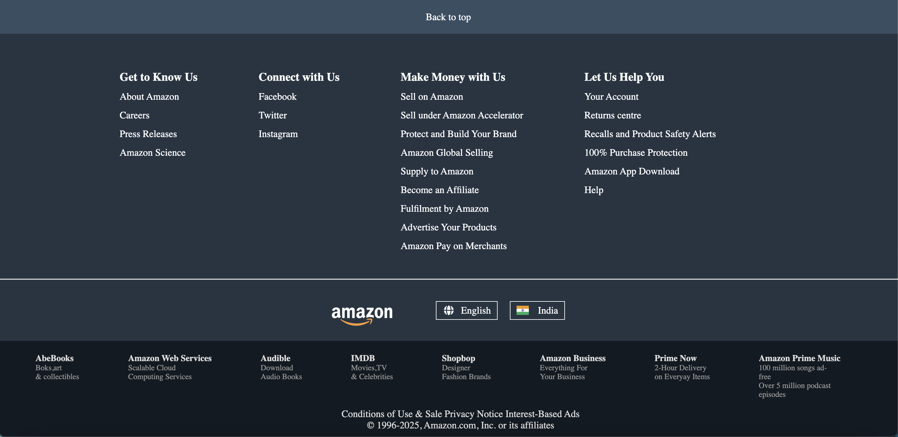

# 🛒 Amazon-Clone

A simple static clone of the Amazon homepage built using HTML5 and CSS3. This project is focused on recreating the core layout and visual appearance of Amazon, mimicking its user interface without any interactivity or backend functionality.

> 🚀 [Live Demo](https://amazon-clone-bhuvan.vercel.app/)  

---

## 📸 Preview



---

## ✨ Features

- Amazon-style navigation bar
- Hero section with promotional banners
- Product cards with images and text
- Multiple sections like Today's Deals, Sign-In box, etc.
- Footer with multiple columns like original Amazon
- Styled using pure CSS
- Organized layout with semantic HTML

---

## 🛠 Built With

- HTML5
- CSS3

> ⚠️ This project is not responsive and is best viewed on desktop screens.

---

## 📁 How to Run Locally

1. Clone this repository:
   ```bash
   git clone https://github.com/your-username/amazon-clone.git